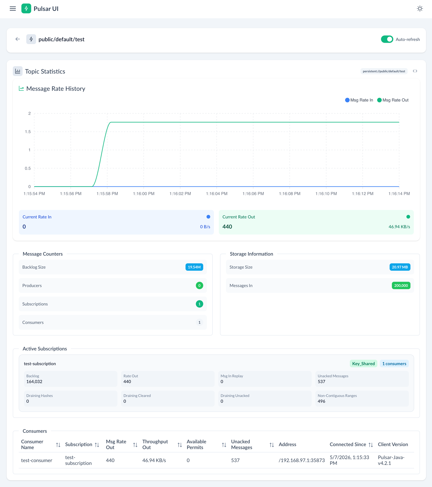

# DSS25 Mastering Key-Ordered Message Processing in Apache Pulsar - parallel processing demo

Demo for DSS25 ("Mastering Key-Ordered Message Processing in Apache Pulsar") that wasn't presented due to time constraints. It compares two ways of consuming a `Key_Shared` Pulsar subscription while
calling a slow downstream HTTP service:

- `pulsar-listener` — classic `MessageListener` with optional virtual-thread per-key dispatch
- `reactive-client-impl` — `pulsar-client-reactive` pipeline with `useKeyOrderedProcessing()`

A `generator` subproject produces test traffic into the topic, and `http-server` serves a
configurable slow HTTP endpoint that the consumers call for each message.

## Modules

| Module | Main class | Purpose |
| --- | --- | --- |
| `http-server` | `SlowService` | HTTP server on `:8888` with `/api/slow` (configurable delay) |
| `generator` | `Generator` | Publishes keyed messages into a Pulsar topic |
| `pulsar-listener` | `PulsarListenerApp` | `MessageListener`-based key-shared consumer |
| `reactive-client-impl` | `PulsarReactiveClientApp` | Reactive pipeline with key-ordered processing |
| `common` | — | Shared `TestEnvironment` and retry helpers |
| `demo-ui` | — | Vue 3 + Vite UI for browsing topics and watching throughput live |

## Prerequisites

- Java 21+ (the Gradle build uses `buildlogic.java-application-conventions`)
- Docker
- The provided `./gradlew` wrapper
- Node.js `^20.19.0 || >=22.12.0` and `npm` (only needed for the `demo-ui`)
- Optional, for the scripted demo: [`just`](https://github.com/casey/just),
  [`tmux`](https://github.com/tmux/tmux), and [`tmuxp`](https://github.com/tmux-python/tmuxp)
  (see [Installing the demo tooling](#installing-the-demo-tooling))

## Quick start with `just` and `tmuxp`

Once `just`, `tmux`, and `tmuxp` are installed (see below), the entire demo can be
launched with:

```bash
just install           # one-time: build backend launcher scripts + demo-ui npm deps
just demo              # opens a tmuxp session with all panes pre-staged
```

`just install` is just shorthand for `just backend-install` (`./gradlew installDist`)
plus `just ui-install` (`npm install` in `demo-ui`). Re-run `just backend-install`
after editing Java code; re-run `just ui-install` after `package.json` changes.

`just demo` loads [`demo-tmuxp.yaml`](demo-tmuxp.yaml), which opens two tmux windows:

- **`infra`** — `just pulsar` (Pulsar broker in Docker) and `just ui` (Vite dev server)
- **`apps`** — `just http-server`, `just pulsar-listener`, and `just generator`

Every pane has `enter: false`, so the commands appear at the prompt **without running**.
Press Enter in each pane in order to step through the demo while talking over it.

To list every recipe: `just --list`. Each app recipe is variadic — pass extra args
after `--`:

```bash
just http-server         -- --delay 500 --jitter 0.2
just generator           -- --number-of-messages 200000 --key-space-size 500 --key-generation UNIFORM_RANDOM
just pulsar-listener     -- --virtual-threads --concurrency 500
just reactive-client-impl -- --concurrency 500 --queue 1000
```

Tear everything down with `just stop` (kills the tmux session and stops the broker; state
preserved) or `just clean` (also drops the `pulsardata` / `pulsarconf` volumes).

## Installing the demo tooling

| Tool | macOS (Homebrew) | Debian/Ubuntu | Notes |
| --- | --- | --- | --- |
| `tmux` | `brew install tmux` | `sudo apt install tmux` | Required to run `tmuxp` |
| `tmuxp` | `uv tool install tmuxp` | `uv tool install tmuxp` | Python CLI; uses `uv` for an isolated install |
| `just` | `brew install just` | `cargo install just` (or [a prebuilt binary](https://github.com/casey/just/releases)) | Command runner |
| `uv` (only if missing) | `brew install uv` | `curl -LsSf https://astral.sh/uv/install.sh \| sh` | Needed for `uv tool install tmuxp` |

After installing, verify with:

```bash
tmux -V
tmuxp --version
just --version
```

The manual step-by-step walkthrough below works without any of these tools — they're
purely a convenience for live demos.

## 1. Start Pulsar in Docker

A [`docker-compose.yml`](docker-compose.yml) at the repo root runs a Pulsar standalone
broker (`apachepulsar/pulsar:latest`) and exposes the binary protocol port `6650` and
the admin HTTP port `8080`. It uses named volumes (`pulsardata`, `pulsarconf`) so state
survives restarts.

```bash
docker compose up pulsar          # foreground; Ctrl-C to stop
# or, equivalently:
just pulsar
```

Wait until the log shows `messaging service is ready`. Verify with:

```bash
curl -s http://localhost:8080/admin/v2/clusters
# => ["standalone"]
```

Lifecycle commands:

```bash
just pulsar-stop      # stop the container, keep volumes (state preserved)
just stop             # also kill the dss25-demo tmux session
just clean            # docker compose down -v: stop, then remove containers AND volumes
```

## 2. Start the demo UI (optional, terminal 0)

The `demo-ui/` subproject is a Vue 3 + Vite app that talks to the Pulsar admin REST API
to show topic stats, message rates, and throughput charts. It is the easiest way to
watch what the consumers are doing while you tweak concurrency settings.

The Vite dev server proxies `/admin` to `http://localhost:8080`, so it works against the
broker started in step 1 with no extra configuration.

```bash
cd demo-ui
npm install        # first run only
npm run dev        # serves http://localhost:5173
```

Open <http://localhost:5173> and navigate to the test topic
(`persistent://public/default/test`) to see live message-rate and throughput charts.
Keep this tab open while running the generator and a consumer in the next steps.

Other useful scripts:

```bash
npm run build         # production build into dist/
npm run preview       # preview the production build
npm run type-check    # vue-tsc type checking
npm run lint          # eslint --fix
```



Open http://localhost:5173 to view the UI.


## 3. Build the backend launcher scripts (one time)

The backend modules (`http-server`, `generator`, `pulsar-listener`,
`reactive-client-impl`) are run via the launcher scripts produced by Gradle's
`installDist` task. Build all of them once with:

```bash
./gradlew installDist
```

Re-run this whenever you change Java code. (The `just install` shorthand also
does this, plus `npm install` in `demo-ui`.)

> **Why not `./gradlew :foo:run --args='...'`?** Gradle 9's CLI parser
> mishandles `--args` values that begin with `--` (e.g. `--args='--delay 500'`),
> rejecting them as unknown options. Running the launcher scripts directly
> avoids the issue and is what the `just` recipes do under the hood.

## 4. Start the slow HTTP service (terminal 1)

In a separate terminal, start the downstream service the consumers will call. This is
the workload that makes concurrency settings observable:

```bash
./http-server/build/install/http-server/bin/http-server
```

By default it listens on `http://localhost:8888/api/slow` with a 100 ms delay and 10%
jitter. Tune it by passing args directly:

```bash
# Slower endpoint — makes concurrency limits much more visible
./http-server/build/install/http-server/bin/http-server --delay 500 --jitter 0.2

# Very fast endpoint
./http-server/build/install/http-server/bin/http-server --delay 10 --jitter 0.0
```

`SlowService` options:

| Option | Default | Description |
| --- | --- | --- |
| `-d`, `--delay` | `100` | Per-request delay in milliseconds |
| `-j`, `--jitter` | `0.1` | Jitter factor (0.0–1.0), added on top of `--delay` |

## 5. Produce test messages (terminal 2)

Publish keyed messages into the default topic `persistent://public/default/test`:

```bash
./generator/build/install/generator/bin/generator --number-of-messages 200000 --key-space-size 500
```

`Generator` options:

| Option | Default | Description |
| --- | --- | --- |
| `-u`, `--url` | `pulsar://localhost:6650/` | Pulsar service URL |
| `-t`, `--topic` | `persistent://public/default/test` | Topic name |
| `-n`, `--producer` | `test-producer` | Producer name |
| `-b`, `--batch` | off | Enable batching (key-based batcher) |
| `-nm`, `--number-of-messages` | `1000000` | Total messages to send |
| `-ms`, `--message-size` | `64` | Payload size in bytes |
| `-ks`, `--key-space-size` | `500` | Number of distinct ordering keys |
| `-km`, `--key-generation` | `GAUSSIAN_RANDOM` | `UNIFORM_ROUND_ROBIN`, `UNIFORM_RANDOM`, or `GAUSSIAN_RANDOM` |
| `-mf`, `--messages-in-flight` | `50000` | Producer in-flight throttle |

Smaller key spaces increase contention on individual keys; `GAUSSIAN_RANDOM` produces
hot keys, while `UNIFORM_*` spreads load evenly.

## 6. Consume the topic (terminal 3)

Pick one of the two consumer implementations. Run them against the same topic +
subscription to compare behaviour.

### Option A — `pulsar-listener` (classic `MessageListener`)

```bash
./pulsar-listener/build/install/pulsar-listener/bin/pulsar-listener --concurrency 100
```

Key options (all in `PulsarListenerApp`):

| Option | Default | Description |
| --- | --- | --- |
| `-c`, `--concurrency` | `100` | Listener thread count, or virtual-thread semaphore limit when `-vt` is set |
| `-vt`, `--virtual-threads` | off | Use a per-key virtual-thread executor (`VirtualThreadsMessageListenerExecutor`) |
| `-q`, `--queue` | `1000` | Receiver queue size |
| `-e`, `--endpoint` | `http://localhost:8888/api/slow` | Downstream HTTP endpoint |
| `-u`, `--url` | `pulsar://localhost:6650/` | Pulsar service URL |
| `-t`, `--topic` | `persistent://public/default/test` | Topic |
| `-s`, `--subscription` | `test-subscription` | Subscription name |
| `-n`, `--consumer` | `test-consumer` | Consumer name |

Useful comparisons (from the repo root):

```bash
PL=./pulsar-listener/build/install/pulsar-listener/bin/pulsar-listener

# Low concurrency: throughput limited by ~10 in-flight HTTP calls
$PL --concurrency 10

# High concurrency on platform threads: 200 listener threads
$PL --concurrency 200

# Virtual threads with per-key ordering, 500 in-flight max
$PL --virtual-threads --concurrency 500

# Smaller receiver queue — more visible backpressure
$PL --virtual-threads --concurrency 500 --queue 100
```

### Option B — `reactive-client-impl` (key-ordered reactive pipeline)

```bash
./reactive-client-impl/build/install/reactive-client-impl/bin/reactive-client-impl --concurrency 100
```

Same options as the listener, except there is no `--virtual-threads` flag — the reactive
pipeline uses `useKeyOrderedProcessing()` to interleave messages across keys while
preserving per-key ordering.

```bash
RC=./reactive-client-impl/build/install/reactive-client-impl/bin/reactive-client-impl

# Low concurrency
$RC --concurrency 10

# Match the high-concurrency listener run for a side-by-side comparison
$RC --concurrency 500 --queue 1000
```

## What to observe

Each consumer logs a running `msg/s` rate every 100 processed messages. The `demo-ui`
(step 2) shows the same numbers as live charts via the Pulsar admin API — useful for
spotting backlog buildup, per-partition skew, and throughput differences side by side.
Try the same generator workload against:

- `pulsar-listener --concurrency 10` vs `--concurrency 200` — throughput scales until
  the downstream service or key skew becomes the bottleneck.
- `pulsar-listener --concurrency 500` vs `pulsar-listener --virtual-threads --concurrency 500`
  — virtual threads let many in-flight blocking HTTP calls coexist cheaply.
- `pulsar-listener --virtual-threads` vs `reactive-client-impl` at the same concurrency —
  both achieve high parallelism; the reactive variant does it without blocking threads.
- `generator --key-space-size 10` vs `--key-space-size 5000` — small key spaces cap
  effective parallelism in `Key_Shared` mode regardless of consumer concurrency.
- `http-server --delay 10` vs `--delay 500` — a slower downstream service makes the
  concurrency knob far more visible.

## Cleanup

Stop the consumer/generator/server with Ctrl-C, then stop the broker:

```bash
docker compose stop pulsar    # or: just pulsar-stop
```

To reset the topic between runs, either:

- use a fresh subscription name with `--subscription` (cheap, keeps broker state), or
- nuke the broker entirely and start over:

  ```bash
  just clean                  # stops the demo, then docker compose down -v (drops volumes)
  just pulsar                 # start a fresh broker
  ```

`just stop` combines `pulsar-stop` with killing the `dss25-demo` tmux session in one
command (state preserved); `just clean` additionally wipes the `pulsardata` /
`pulsarconf` volumes (it depends on `stop`, so it stops everything first if it's running).

## Acknowledgements

The `VirtualThreadsMessageListenerExecutor` used by `pulsar-listener` (in
[`PulsarListenerApp.java`](pulsar-listener/src/main/java/com/github/lhotari/dss25/listener/PulsarListenerApp.java))
was inspired by Philipp Dolif's
[**pulsar-virtual-threads-message-listener**](https://github.com/pdolif/pulsar-virtual-threads-message-listener)
project. Thanks to Philipp for the original idea and reference implementation.

## License

Licensed under the [Apache License, Version 2.0](LICENSE). See [`NOTICE`](NOTICE) for
third-party attributions.
